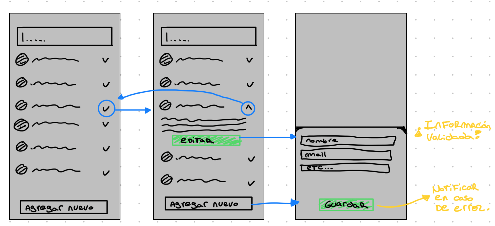

# Challenge React Native - ⚡ Light It

Aplicación Front-End para manejar la información de pacientes.

## Tabla de Contenidos

1. [Instalación](#instalación)
2. [Uso](#uso)
3. [Decisiones de Diseño](#decisiones-de-diseño)
4. [Wireframes](#herramientas-y-librerías)

## Instalación

### Requisitos previos

Se debe tener instalado lo siguiente en tu sistema:

- [Node.js](https://nodejs.org/)
- [Yarn](https://classic.yarnpkg.com/en/docs/install)
- [React Native CLI](https://reactnative.dev/docs/environment-setup)
- Emulador para Android/iOS

### Configuración del entorno

Sigue las instrucciones de [Configuración del Entorno de React Native](https://reactnative.dev/docs/environment-setup) para asegurarte de que tu entorno esté configurado correctamente.

### Instalación de dependencias

Clona el repositorio y luego instala las dependencias:

#### Paso 1: Clonar el repositorio e instalar las dependencias

```bash
git clone https://github.com/nicoizra/ChallengeLightIt.git
```

```bash
# npm
npm install && cd ios && pod install && cd ..

# Yarn
yarn install && cd ios && pod install && cd ..
```

#### Paso 2: Correr el Metro Server

```bash
# using npm
npm start

# OR using Yarn
yarn start
```

#### Step 3: Correr la App

#### Android

```bash
# npm
npm run android

# Yarn
yarn android
```

#### iOS

```bash
# npm
npm run ios

# Yarn
yarn ios
```

> Tras ejecutar estos comandos, la App debería mostrarse en el emulador sin problemas. Para ejecutarlo en iOS, en el package.json se puede modificar el script "ios", para elegir el emulador sobre el que se va a ejecutar.

## Uso

La idea principal es una aplicación en donde uno entra y obtiene un listado de pacientes con sus datos de un API. Luego puede editarlos o cargar nuevos en caso que sea necesario.

Cuenta con validación a la hora de agregar o editar los datos y notifica al usuario cuando estos cambios ocurren de manera correcta.

## Decisiones de Diseño

Desarrollé componentes reutilizables en su mayoría, para poder aprovechar principios como DRY (No repetir código). Trate de hacer los componentes lo más atómicos posibles para poder generar un código más cohesivo y mantenible (SOLID: Single Responsibility).

En cuanto a los estilos, utilicé un Theme que provee react-native-paper para aprovechar su esquema, y fui modificando los estilos según necesite. Los componentes los estilé con StyleSheet.

Utilice una librería de terceros que permitía realizar los Toasts, para indicarle al usuario cuando los cambios se habían realizado de manera correcta.

El estado global de la aplicación - aunque fuese chico y simple - lo manejé con Context ya que me parece la herramienta más cómoda para la funcionalidad. De este modo, dispuse de un Provider para manejar las llamadas a la API de pacientes y las funciones para modificar las listas de los mismos.

El código está tipado con TypeScript para generar una mayor legibilidad y que sea más simple de entender/mantener.

## Wireframes

Para diseñar la App, previamente decidí armar unos wireframes de cómo sería visualmente. Esto me permitió ahorrar tiempo y tener una visión más clara de lo que estaba buscando lograr.

### Wireframes:


